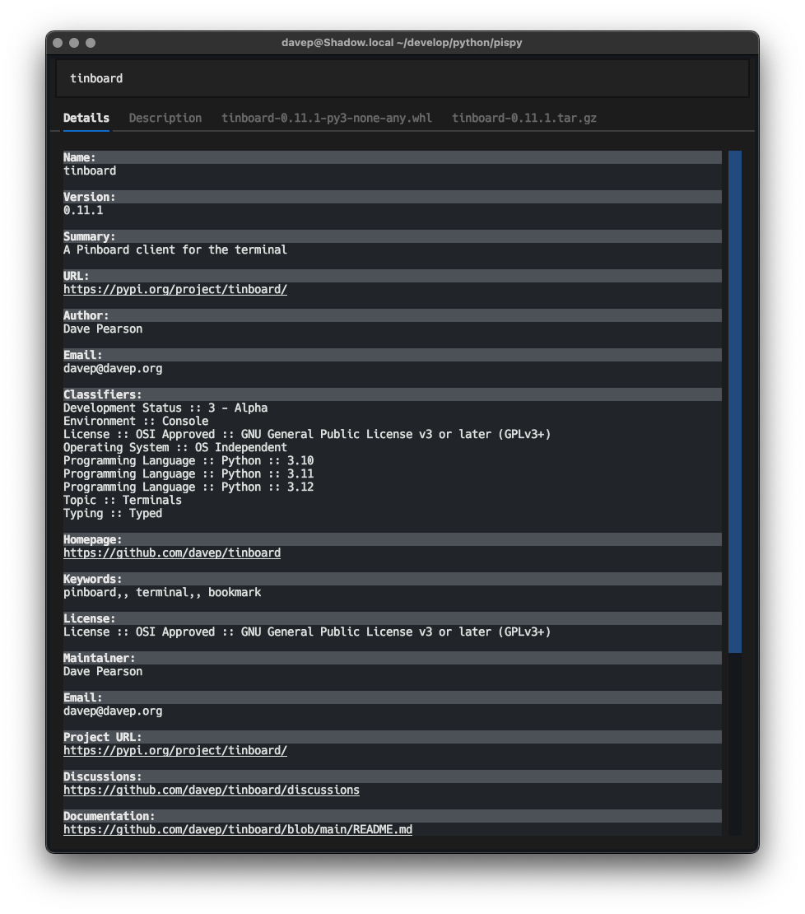

# PISpy

## Introduction

PISpy aims to be a simple but useful [PyPi](https://pypi.org/) lookup client
for the Terminal, built with [Textual](https://textual.textualize.io/).

## Work in progress

PISpy is currently a work in progress. I'm still figuring out what it should
do and how; but for now it provides a simple package lookup interface.

[//]: # (README.md ends here)
